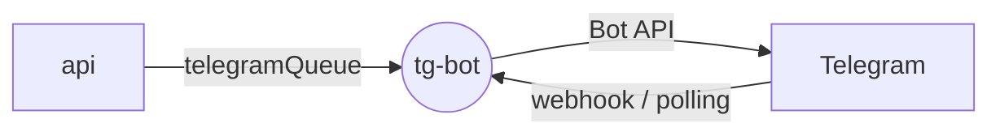

# PingTower Telegram Bot

Telegram bot that delivers PingTower alerts and greets users with links to the dashboard.

Stack: Python 3.12, FastAPI, aiogram 3, FastStream, RabbitMQ.

## Role in the system

tg-bot is a thin delivery channel. Users link their Telegram account in the web app (Telegram Login Widget,
verified by the `api`); when a server changes status, the api composes the
alert text and buttons and puts them into `telegramQueue`. The bot just sends them — all business logic
stays in the api.



## Features

- **Alert delivery** — sends HTML-formatted messages with optional inline-button rows (e.g. *Open dashboard*).
- **`/start`** — configurable welcome text with buttons to the web app and the source code.
- **Webhook or polling** — `TG_BOT_MODE=webhook` registers the webhook on startup and verifies `X-Telegram-Bot-Api-Secret-Token`; `polling` is handy for local development.
- **Proxy support** — optional `TG_BOT_PROXY_URL` (HTTP/SOCKS) for networks where Telegram is blocked.
- **Health check** — `GET /healthz` for Docker and the reverse proxy.

## Contracts

| Direction | Channel | Name | Payload |
| --- | --- | --- | --- |
| In | work queue (default exchange) | `telegramQueue` | `{ "chatId", "text", "inlineButtons": [[{ "text", "url" \| "callbackData" }]] }` |
| In | HTTP | `POST /webhooks/telegram` | Telegram updates (webhook mode) |
| Out | Telegram Bot API | `sendMessage` | alert to the linked chat |

## Quick start

**Whole stack** — via `infra` (all repos cloned side by side):

```bash
make -C infra up
```

**This service only** (broker already running from infra). Create `.env` with the `TG_BOT_*` settings —
at least `TG_BOT_BOT_TOKEN`, `TG_BOT_RABBITMQ_URL`, `TG_BOT_WEB_APP_URL`, `TG_BOT_GITHUB_URL`, and
`TG_BOT_WEBHOOK_BASE_URL` in webhook mode — then:

```bash
docker compose up -d --build
```

**Local development:**

```bash
uv sync
TG_BOT_MODE=polling uv run tg-bot
uv run python -m unittest discover -s tests
```

## Structure

```text
tg-bot/
├── src/tg_bot/
│   ├── app.py          # FastAPI app: /healthz, Telegram webhook
│   ├── main.py         # uvicorn entrypoint (`tg-bot` script)
│   ├── config/         # pydantic-settings, TG_BOT_* env vars
│   ├── messaging/      # queue message models
│   ├── services/       # bot runtime: webhook/polling, FastStream subscriber
│   └── telegram/       # /start handler, keyboards
└── tests/              # unit and integration tests
```
